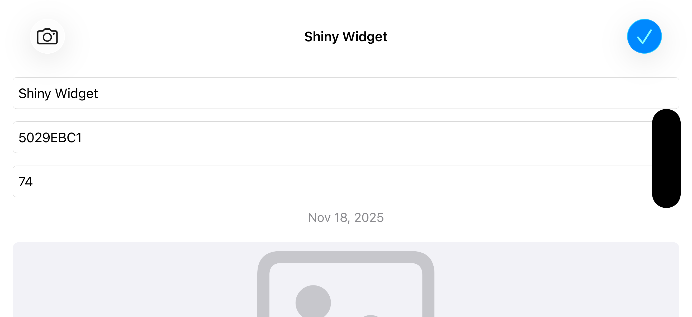

# LootLogger Project 6

Big Nerd Ranch iOS Programming - Chapters 13, 15, and 16

## Chapter 13
**Silver Challenge:** Saving, Loading, and Scene States
- Items and photos persist to disk
- Automatic save/load on app lifecycle

**Bronze Challenge:** Throwing Errors
- `saveChanges()` throws instead of returning Bool
- Proper error propagation with try/catch

## Chapter 15
**Silver Challenge:** Removing an Image
- Button to delete item photos
- Removes from cache and disk

**Bronze Challenge:** Allow Image Editing
- Users can crop/adjust photos before saving
- Prefers edited image, falls back to original

## Chapter 16
**Bronze Challenge:** Stacked Text Field and Labels
- Fields stack vertically in compact height (landscape)
- Adapts layout based on size class
- Horizontal arrangement in regular height

